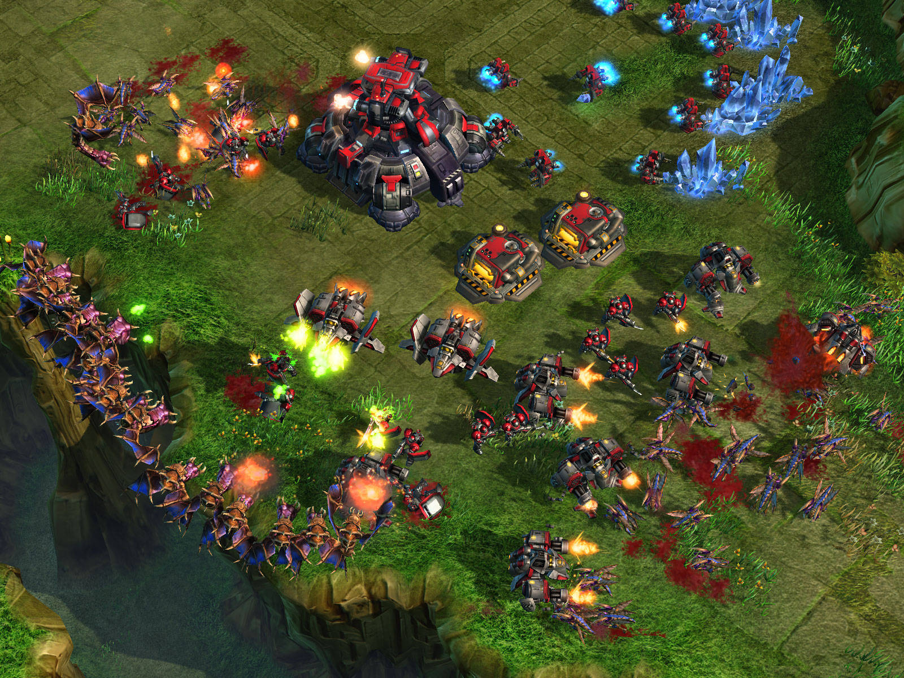

##1. Introduction


> This project is an exploratory data analysis of a dataset originating from the computer game "Starcraft II" (henceforth referred to as "SC2" for short). SC2 belongs to the real-time strategy (RTS) genre, which typically involve players managing military bases and directly controlling armies in order to combat opposing players' armies and destroy their bases. In SC2, players control one of three factions, each with completely different playstyles and abilities. All player actions happen in real-time. Thus, a successful player must be able to construct buildings, gather resources, and raise an army while simultaneously controlling existing combat units. This dichotomy is referred to macromanagement and micromanagement, or "macro" and "micro" for short. In addition, each player's view of the battlefield is limited by the "fog of war", a term that means that each player can only see in locations where his units and buildings are present. Otherwise, that part of the map is obscured. Thus, a successful player must be able to construct buildings, gather resources, and raise an army while simultaneously controlling existing combat units and maintaining awareness of what the enemy is doing on the battlefield. A more detailed description of the game written by the researchers who compiled this dataset can be found [here](http://skillcraft.ca/about-the-project.html).


> The purpose of this study is to investigate SC2 as a tool for measuring how people learn and acquire expertise. These replay files are a complete record of everything that happens during the course of a game, including various metrics related to the game state, what each player is looking at, and where every game unit is located at any given point in time. These games were played on the 1 vs. 1 online ladder system, which places players in one of seven "leagues" according to a "ladder rank" calculated by a matchmaking algorithm. One's ladder rank is based on his or her win-loss record and the ladder rank of the opponent in each game. When a player wishes to play, the system attempts to find an opponent with a similar ladder rank. Once a player becomes skilled enough to consistently defeat opponents within the same league, the matchmaking system will begin matching the player against opponents of the next highest league. If the player wins enough of these games, then he or she will be promoted to that league. Similarly, if a player is consistently losing against opponents within the same league, the matchmaking system will begin matching the player against opponents in the next lowest league. If the player loses enough of these matches, then he or she will be demoted to that league.


> What makes SC2 an interesting game to study is the fact that the sheer complexity of the game in terms of all the things that could happen at any given moment compounded across an entire game means that every game is unique. Each game can unfold in a seemingly infinite number of different ways. The popularity of SC2 has led to a sustained professional scene, where players are sponsored by teams and compete in tournaments for cash prizes. These tournaments can take place online or offline, where players are flown into a studio or arena to compete in front of a live audience. These events are accompanied by commentators who serve a similar role to those in traditional sports. In the past, the first place prizes at the most prestigious tournaments have reached $100,000. This competitive scene has provided the game's passionate fanbase with a clear motivation for becoming better at the game. The professional players serve as role models for how to become better (A beginner's guide to competitive SC2 can be found [here](https://www.youtube.com/watch?v=JSPRgL4D1no)). As a passionate member of this community during the time that this dataset was compiled, I made a serious (but short-lived) attempt to improve my SC2 skill level, during which I absorbed various advice and generally accepted wisdom on how one can get better at the game, as well as a deep appreciation for the talents of professional SC2 players. With this dataset, I would like to see if these community best practices are supported by the differentiation of skill levels based on the league placement of the study participants. At the conclusion of their paper, the researchers discussed the next study that they were embarking on, which involved accepting large numbers of replay files from each participant in order to search for changes in skill level over time. Though each data point in this dataset represents a single moment in time for one player, I want to explore how in-game metrics change across age groups and experience levels both within and across ranks. I plan on using variables in the dataset related to time to see if there are any general trends over time that can be discerned.


> The researchers approached this study from a cognitive science perspective, introducing a new unit of measurement called the Perception-Action Cycle (PAC), which attempts to quantify skill in terms of the amount of time elapsed between a player perceiving an event and acting upon it (a more detailed explanation of the PAC can be found [here](https://www.youtube.com/watch?v=bnRQMv0xIgg)). They hypothesized that the variables that are most correlated with skill change as a player improves and moves up the ranks of the ladder and showed that machine learning methods can be used to predict a player's rank based on such variables. I wish to avoid using variables related to PAC since I don't believe that I have the necessary cognitive science background to understand how they were derived and what they signify. Also, I want to avoid retreading the path the researchers took, since their paper focused heavily on PAC and its relation to skill level.


##2. Team


> Since I am working alone for this project, I am planning on exploring and analyzing this dataset with the following agenda:


***

1. Check the self-reported variables for nonsensical/missing/outlier values and decide on a way to deal with them
2. Analyze the three self-reported time variables not derived from the replay files, *TotalHours*, *HoursPerWeek*, and *Age*
3. Propose an approximate order of importance among the in-game metrics included in the dataset (in terms of which skills the SC2 community deems essential for increasing skill level as opposed to what's "nice to have", similar to Maslow's hierarchy of needs)
4. Explore these variables individually in the order proposed
5. Visualize these variables together with the time variables to get an imprecise idea of how these metrics changes over time
6. Create multivariate plots to find possible relationships between different metrics across different leagues and experience levels

***


##3. Analysis of Data Quality


> The dataset used for this analysis originates from the research paper [Video Game Telemetry as a Critical Tool in the Study of Complex Skill Learning](http://journals.plos.org/plosone/article?id=10.1371/journal.pone.0075129#pone-0075129-g001) (Thompson et al, 2013) and can be found [here](http://summit.sfu.ca/item/13328). From August 12th, 2011 to September 19th, 2011, the researchers solicited members of various online SC2 community hubs for their game replay files, from which I found out about this study. Contributors were also asked to complete a survey that asked about their age, skill level, and playing habits. Since each replay file only contains information about what happens during the course of the one game that the file originated from, it is unable to provide players' personal details such as age or how long they've been playing the game. Additionally, a player's league isn't included since that information doesn't directly affect the game once the matchmaking system is done finding an opponent. The league names, in order of increasing skill, are Bronze, Silver, Gold, Platinum, Diamond, Master, and GrandMaster. Data points with a *LeagueIndex* value of 8 indicate replay files of professional games that were shared with the public. These replays were subsequently submitted to the study by community members, which is why these replays all have missing values for self-reported variables.


> It should be noted that "professional" simply means that those replays are of games that were played by professional players in tournaments. There is no "professional" league in the ladder system. Also, the GrandMaster League is limited to the top 200 players. It is necessary for a player to be successful in the GrandMaster League in order to play SC2 professionally, so there is a chance that professional players can be represented in both leagues in this dataset. However, this is unlikely due to their tendency to hide their identities when playing online as much as possible. This is so that their rivals don't get opportunities to study them. Therefore, it is highly unlikely that a professional player participated in this survey and willingly submitted his own replays of GrandMaster League games played online to this dataset. Due to the small sample size of professional replays in the dataset (55/3395) and the lack of accompanying player information I decided to remove these replays from the datast. 


> My analysis begins with loading the csv file containing the dataset and converting integer variables that were imported as factors. I then create a new variable called *rank* that adds the proper name for each player's league based on the *LeagueIndex* variable. While the variables derived from the replay files are inherently accurate, the variables derived from survey answers should be checked for inaccuracies and irregularities. 


```{r warning=FALSE, message=FALSE}

library(tidyverse)

sc <- read.csv('StarCraft2ReplayAnalysis-1.csv')

#Remove professional replays

sc <- filter(sc, sc$LeagueIndex != 8)

#Convert factors back to integers
#Automatically replace "NULL" string values with "NA"

sc$TotalHours <- as.integer(as.character(sc$TotalHours))
sc$HoursPerWeek <- as.integer(as.character(sc$HoursPerWeek))
sc$Age <- as.integer(as.character(sc$Age))

#Add a new variable "League" so that the values in the included "LeagueIndex" variable are associated with the names of each league

rank <- c('Bronze', 'Silver', 'Gold', 'Platinum', 'Diamond', 'Master', 'GrandMaster')
rank <- factor(rank, levels = c('Bronze', 'Silver', 'Gold', 'Platinum', 'Diamond', 'Master', 'GrandMaster'))
sc <- mutate(sc, League = rank[LeagueIndex])

```


###*HoursPerWeek* and *TotalHours*


>  Since my analysis will partly be focused on the change in player metrics as a function of time, it would be appropriate to start with the two time variables, *HoursPerWeek* and *"*TotalHours*"*. These variables are prone to reporting inaccuracy due to the fact that participants are attempting to generalize several months of playing experience and habits into two numbers. By removing outlier values and drawing scatterplots, it is also obvious that the reported values for both variables have been rounded. For *TotalHours*, the rounding looks to have been done by the respondents since there are data points scattered between rounded values. For *HoursPerWeek*, I assume that respondents could only choose from certain  values preselected by the researchers rather than typing their answer manually.


```{r}

ggplot(sc %>% filter(TotalHours < 2000), mapping = aes(x = TotalHours, y = APM)) + geom_point(alpha = 0.3, color = 'purple') + labs(title='Total Hours Played vs. APM') + theme(panel.background = element_rect(fill = 'white'), panel.grid.major =  element_line(color = 'gray'))
ggplot(sc %>% filter(HoursPerWeek < 50), mapping = aes(x = HoursPerWeek, y = APM)) + geom_point(alpha= 0.3, color = 'purple') + labs(title='Hours Played per Week vs. APM') + theme(panel.background = element_rect(fill = 'white'), panel.grid.major =  element_line(color = 'gray'))

```


```{r}

summary(sc$HoursPerWeek)
summary(sc$TotalHours)

```


> What immediately stands out in the summary statistics is the maximum values for both variables. The maximum value for *HoursPerWeek* corresponds to 24 hours per day of playing time every week, while the maximum reported value of 1,000,000 for *TotalHours* far exceeds the number of hours that had elapsed since SC2 was released to the time that the data collection period concluded. When I discussed this matter with Professor Robbins, one of her suggestions was to "fence" the values such that outliers are replaced with a sensible ceiling value. From interviews of professional players as well as hearsay from those who keep in contact with them, I chose 98 hours played per week as a ceiling value. This corresponds to 14 hours played per day, which is a habit that could most likely only be sustained by professional players signed to a major team. Such teams often operate a "team house" where all the players live and train together. It is not uncommon for the sponsors to hire maids to cook and clean so that the players can focus all their attention on playing SC2. In such cases, it is not unusual for players to devote 10-14 hours per day to practicing for upcoming important matches.


> Another suggestion was to simply remove these outliers from the dataset, since the respondents might not have given a serious answer to the question. When both methods are compared side by side below, there doesn't seem to be any appreciable difference due to the small number of outliers (56 out of 3,339). As for the single data point with a value of 0 hours per week, I interpreted that as the respondent playing the game very infrequently. Because there was only one such data point and the fact that the next closest value is 2, I decided not to remove it. 


```{r warning=FALSE, message=FALSE}

#Restrict "HoursPerWeek" to a maximum value of 98

sc_restrict <- sc
sc_restrict$HoursPerWeek <- ifelse(sc_restrict$HoursPerWeek > 98, 98, sc_restrict$HoursPerWeek)

ggplot(sc_restrict, aes(sc_restrict$HoursPerWeek)) + geom_density(bw = 2.5, fill = 'purple', alpha = .5) + labs(x = 'Reported Hours Played Per Week', title = 'HoursPerWeek Outliers Fenced') + scale_x_continuous(breaks = c(seq(0, 100, by = 5))) + theme(panel.background = element_rect(fill = 'white'), panel.grid.major =  element_line(color = 'gray'))

#Remove data with "HoursPerWeek" values greater than 98

sc_remove <- sc
sc_remove <- filter(sc, HoursPerWeek <= 98)

summary(sc_restrict$HoursPerWeek)
summary(sc_remove$HoursPerWeek)

ggplot(sc_remove, aes(sc_remove$HoursPerWeek)) + geom_density(bw = 2.5, fill = 'purple', alpha = .5) + labs(x = 'Reported Hours Played Per Week', title = 'HoursPerWeek Outliers Removed') + scale_x_continuous(breaks = c(seq(0, 100, by = 5))) + theme(panel.background = element_rect(fill = 'white'), panel.grid.major =  element_line(color = 'gray'))

```


> This variable looks to be unimodal after adjusting the bandwidth of the density plot, with a mode of approximately 7 and a mean of 15.87. The mean value corresponds to around 2 hours per day of play, which sounds reasonable for that time period, during which the game was still relatively new and the fanbase was at its largest. The distribution is right-skewed, which gives an idea of how many 'typical' players there are compared to the more dedicated ones 


> Similarly, I tried both restricting the maximum value for *TotalHours* to 8,106 and removing data points that exceed that value. I arrived at this theoretical maximum by counting the number of days from the earliest date that a member of the general public could begin playing the game consistently (the pre-release beta test period began on February 17th, 2010) to the end of the data collection period, September 19th, 2011. Assuming that an extremely dedicated fan played the theoretical maximum of 14 hours per day every day during that period, he or she will have played the game for a total of 8,106 hours. 


```{r warning=FALSE, message=FALSE}

#Restrict "TotalHours" to a maximum value of 8,106

sc_restrict$TotalHours <- ifelse(sc_restrict$TotalHours > 8106, 8106, sc_restrict$TotalHours)
summary(sc_restrict$TotalHours)

ggplot(sc_restrict, aes(sc_restrict$TotalHours)) + geom_histogram(binwidth = 200, fill = 'purple', alpha = .5) + labs(x = 'Reported Total Number of Hours Played', title = 'TotalHours Outliers Restricted') + theme(panel.background = element_rect(fill = 'white'), panel.grid.major =  element_line(color = 'gray'))

#Remove data with "TotalHours" values greater than 8,106

sc_remove <- filter(sc_remove, TotalHours <= 8106)
summary(sc_remove$TotalHours)


ggplot(sc_remove, aes(sc_remove$TotalHours)) + geom_histogram(binwidth = 200, fill = 'purple', alpha = .5) + labs(x = 'Reported Total Number of Hours Played', title = 'TotalHours Outliers Removed') + theme(panel.background = element_rect(fill = 'white'), panel.grid.major =  element_line(color = 'gray'))

```


> Again, both methods for dealing with outliers yield almost identical distributions. In the above histograms, several outlier values that are well below 8,106 hours and yet well above the median of 500 can be seen. Sustaining a 14 hour per day SC2 habit in addition to sleep time and any possible school and work responsibilities would be quite difficult. Even a professional player would have trouble keeping up with that level of practice for an extended period of time without feeling mental exhaustion or experiencing wrist injuries. Therefore, I decided to further restrict this variable to a maximum value of 4,000 hours, which corresponds to approximately 7 hours per day. 


```{r warning=FALSE, message=FALSE}

#Further restrict "TotalHours" to a maximum value of 4,000

sc_restrict$TotalHours <- ifelse(sc_restrict$TotalHours > 4000, 4000, sc_restrict$TotalHours)
summary(sc_restrict$TotalHours)

ggplot() + geom_histogram(data = sc_restrict, aes(x = sc_restrict$TotalHours), binwidth = 200, fill = 'purple', alpha = .5) + labs(x = 'Reported Total Number of Hours Played', title = 'TotalHours Outliers Restricted') + scale_x_continuous(breaks = c(seq(0, 4000, 250))) + theme(panel.background = element_rect(fill = 'white'), panel.grid.major =  element_line(color = 'gray'))

ggplot() + geom_density(data = sc_restrict, aes(x = sc_restrict$TotalHours), bw = 75, fill = 'purple', alpha = .5) + labs(x = 'Reported Total Number of Hours Played', title = 'TotalHours Outliers Restricted') + scale_x_continuous(breaks = c(seq(0, 4000, 250)))  + theme(panel.background = element_rect(fill = 'white'), panel.grid.major =  element_line(color = 'gray'))

#Further remove data with "TotalHours" values greater than 4,000


sc_remove <- filter(sc_remove, TotalHours <= 4000)
summary(sc_remove$TotalHours)

ggplot() + geom_histogram(data = sc_remove, aes(x = sc_remove$TotalHours), binwidth = 200, fill = 'purple', alpha = .5) + labs(x = 'Reported Total Number of Hours Played', title = 'TotalHours Outliers Removed') + scale_x_continuous(breaks = c(seq(0, 4000, 250))) + theme(panel.background = element_rect(fill = 'white'), panel.grid.major =  element_line(color = 'gray'))

ggplot() + geom_density(data = sc_remove, aes(x = sc_remove$TotalHours), bw = 75, fill = 'purple', alpha = .5) + labs(x = 'Reported Total Number of Hours Played', title = 'TotalHours Outliers Removed') + scale_x_continuous(breaks = c(seq(0, 4000, 250)))  + theme(panel.background = element_rect(fill = 'white'), panel.grid.major =  element_line(color = 'gray'))

```


> By removing the outlier values, the tail small bump at 4,000 hours is noticeably reduced. The distribution for *TotalHours* looks to have a larger variance compared to that of *HoursPerWeek*. Both distributions are similarly right-skewed, which is to be expected since these two variables are most certainly correlated. Depending on the parameter settings for the density plot and histogram, there might be evidence of bimodality, with a distinct mode of approximately 450 and another possible one of at approximately 700. The mean of 639.2 corresponds to approximately 1.5 hours of SC2 per day, which translates to around four average length 1 vs. 1 matches. 


###*Age*


> Although age is only an indirect indicator of the passage of time, I want to search for trends across different age groups. In the Starcraft community, it is commonly believed that one's skill declines with age, such that past the early to mid 20's, hand movement and reaction speeds begin to slow down. This belief is reinforced by the fact that an overwhelming majority of tournament champions are relatively young, often still in their teens. While the researchers plan to investigate whether or not such a physiological decline actually occurs in their next study, I feel that it would be sensible to see if there's any supporting evidence for this belief using this dataset, even though it's not as scientifically valid as analyzing a large quantity of replay files associated with individual players' experiences with the game over a long period of time.


```{r warning=FALSE, message=FALSE}

#Continuing the analysis by removing outlier values rather than restricting them

sc <- sc_remove

summary(sc$Age)

ggplot(sc, aes(sc$Age)) + geom_histogram(binwidth = 1, fill = 'purple', alpha = .5) + scale_x_continuous(breaks = c(seq(10,44, 2))) + labs(x = 'Age of the Participant') + theme(panel.background = element_rect(fill = 'white'), panel.grid.major =  element_line(color = 'gray'))


ggplot(sc, aes(sc$Age)) + geom_density(bw = .5, fill = 'purple', alpha = .5) + labs(x = 'Age of the Participant') + theme(panel.background = element_rect(fill = 'white'), panel.grid.major =  element_line(color = 'gray')) + scale_x_continuous(breaks = c(seq(10,44, 2)))

```


> A noticeable feature of this distribution is the abrupt cutoff point at 16. This is most likely due to ethical restrictions that the researchers adhered to with respect to allowing minors to participate in the study, rather than a lack of younger SC2 players. Were it not for this, the age distribution would look almost normally distributed, with a mode of 21 and mean of 21.65. The distribution proceeds fairly smoothly to the maximum age of 44. Due to the smoothness of the distribution, I decided to not treat participants in their early 40's as outliers. The slope of the distribution significantly decreases past age 22, which lends support to the community's perceived notions concerning age and skill level.


###*APM* (Actions per Minute)





> Proceeding to the in-game metrics, I feel that the most obvious one to explore is *APM*, short for Actions Per Minute. An action is defined to be any key press or mouse click performed by the player. In SC2, *APM* is almost synonymous with level skill. It is typically understood that if a player can't perform actions at a rate that is comparable to that of the opponent, then he or she simply can't keep up and will eventually be overwhelmed due to the fact that the opponent can accomplish more in the same amount of time. The description accompanying this dataset does not specify whether the included *APM* values are average or maximum values achieved during each game. I assume that they represent average values since average APM is one of the metrics that the game presents to the player at the conclusion of each game.


> During battles, a skilled player should be able to position his army properly and micromanage several units simultaneously without neglecting the more mundane tasks of producing workers and constructing buildings back at base. Winning a battle while forgetting to manage one's bases could leave one in a worse position and allow the opponent to catch up in the near future.


```{r warning=FALSE, message=FALSE}
summary(sc$APM)

ggplot(sc, aes(sc$APM)) + geom_density(bw = 3, fill = 'purple', alpha = .5) + labs(x = 'Actions Per Minute') + theme(panel.background = element_rect(fill = 'white'), panel.grid.major =  element_line(color = 'gray')) + scale_x_continuous(breaks = c(seq(20,400, 20)))

```


> The distribution for *APM* looks to be approximately normally distributed, with a median of 108 and a mean of 117. The slope  on the left side is much steeper, with a minimum value of 20. This sounds reasonable, since 20 actions per minute can be achieved by nearly any able-bodied person using a computer without much effort. On the other end, we see some values exceeding 360, which translates to a sustained rate of 6 actions per second. Though there have been a few professional players who were known for consistently attaining such exceptionally high APM values, it could also be the case that the *APM* outlier values in this dataset are due to some players inflating their APM by rapidly performing meaningless actions, such as clicking empty spaces. Often, players do this at the beginning of a game to warm up their hand muscles since there's typically not much to do at such an early stage of a game. However, it could be the case that some players continue doing this throughout their games, possibly with the intention of inflating their APM rate. A few years after these replays were collected, an improved APM measurement that filters out such meaningless actions was added to the game. Using that metric, we would be unlikely to see such extreme values.


```{r warning=FALSE, message=FALSE}

ggplot(sc, aes(sc$League, sc$APM)) + geom_boxplot(outlier.color = 'blue', fill = 'purple', alpha = 0.5) + theme(panel.background = element_rect(fill = 'white'), panel.grid.major =  element_line(color = 'gray')) + labs(x = 'League', y = 'APM') + scale_y_continuous(breaks = c(seq(0, 400, 25)))

```


> Plotting the distribution of APM versus league rank supports the idea these outlier *APM* values were artificially inflated. They originate from players in Diamond and Master League, which is far from the highest levels of competitive play. These outliers are far removed from the median values of their respective leagues. The fact that several values exceed even the highest APM for GrandMaster players suggests that they are not realistically attainable values for players in these leagues. Therefore, I decided to remove data points where *APM* values exceed 275, which is the approximate median value for the professional players represented in this dataset.


```{r warning=FALSE, message=FALSE}

#Remove data points belonging to Diamond and Master League that have over 275 APM

sc <- sc[!(sc$APM > 275 & sc$League == 'Diamond'),]
sc <- sc[!(sc$APM > 275 & sc$League == 'Master'),]

ggplot(sc, aes(sc$APM)) + geom_density(bw = 3, fill = 'purple', alpha = .5) + labs(x = 'Actions Per Minute') + theme(panel.background = element_rect(fill = 'white'), panel.grid.major =  element_line(color = 'gray')) + scale_x_continuous(breaks = c(seq(20,400, 20)))

```


```{r}

ggplot(sc, aes(sc$League, sc$APM)) + geom_boxplot(outlier.color = 'blue', fill = 'purple', alpha = 0.5) + theme(panel.background = element_rect(fill = 'white'), panel.grid.major =  element_line(color = 'gray')) + labs(x = 'League', y = 'APM') + scale_y_continuous(breaks = c(seq(0, 400, 25)))

```


> Having removed these outlier values, the shape of the density plot did not change much, but the boxplot looks more reasonable. There is a positive correlation between *League* and *APM* that supports the idea that APM is a reasonable indicator of skill level. However, it should be noted that player actions can rarely be accurately categorized as either "meaningful" or "meaningless". There are often several events happening simultaneously across the battlefield that demand a player's attention. SC2 expertise heavily depends on the ability to prioritize these events and focus attention on the most important ones. To give two extreme examples, a player who devote full attention to only controlling a single unit at a time will most likely not win too many games, much like a player who instantly shifts his or her attention to the latest event without any prioritization. Even with "meaningful" actions, the decisions that a player makes can be judged on a continuous scale of effectiveness that depends on the context of what is happening and what the player knows at that moment. In broadcasted games, commentators are expected to analyze these decisions and point out which ones they think are wise or unwise. Thus, one cannot declare that one player is definitely better than another player based solely on a comparison of APM.


##4. Executive Summary


##5. Main Analysis


> It is commonly thought that higher APM comes naturally through becoming more skilled at SC2. In the SC2 community, it is believed that there is a rough heirarchy of skills that one should acquire in order to become skilled. The variables corresponding to these skills, ranked in approximate descending order of importance, are the following:


1. *WorkersMade*
2. *MinimapAttacks*
3. *AssignToHotkeys* / *SelectByHotkeys*
4. *TotalMapExplored*
5. *UniqueUnitsMade*
6. *ComplexAbilitiesUsed* / *ComplexUnitsMade*
7. *UniqueHotkeys*


> It should be noted that these variables are rates expressed in "timestamps", which is the way that the game calculates time. There are approximately 88.5 timestamps per second according to the dataset documentation. Since such a short measure of time creates very small values, I will express these variables in either seconds or minutes to make the graphs easier to understand. Throughout this section, I encountered outliers for several variables that made it difficult to read the graphs. I dealt with these outlier values by removing them from the dataset. I made this decision due to these data points comprising an extremely small portion of the dataset. Also, since most of these metrics are more obscure and not discussed often in the community, it would be difficult to decide on a "reasonable" ceiling value to restrict these variables to.

> In addition, I decided to omit the *MaxTimeStamp* variable from my analysis. This variable indicates the length of each game. While there may be some correlation between how skilled a player is and his or her average game length, each player's choice in strategy has a major effect on how long a particular game will be. For example, before a game begins, a player can decide to invest significant resoures early on into doing a quick surprise attack to catch the opponent off guard. If such an attack fails, then the attacking player will be in a vulnerable position and may be defeated by the opponent's counterattack. In this case, the game is likely to end early regardless of the outcome. On the other hand, both players can just as easily decide to focus on their own army and building production while avoiding conflicts early on. Such a game would take much longer to finish. Since game length is largely affected by conscious choices that players make in addition to behavior derived from skill level, it would be difficult to isolate these two factors in orde to assess *MaxTimeStamp* as an indicator of skill level.


###*WorkersMade*


> The typical answer to the question of how one gets better at SC2 is to make more workers. This might seem surprisingly at first. Worker units are meant to collect resources, construct buildings, and sometimes to serve as sacrificial pawns during attacks or defenses. However, collecting enough resources is of utmost importance, since this is the currency with which players build their army and bases. People often tell novices that they can get promoted out of Bronze League with this simple strategy: make lots of workers, collect lots of resources, build an army with those resources, and send that army straighht to the enemy base.


> The violin plot below shows that there is a slightly positive correlation between how workers are produced per minute and the rank of the player. By looking at the median lines, one can see a slight downward trend going from Master to GrandMaster. A more pronounced increase can be seen when looking at the outlier values from Diamond to GrandMaster. This demonstrates that one should find the proper balance between making too few workers (collecting resources at a suboptimal rate) and making too many (wasting money by producing unneeded workers who have nothing to do). On the other end, the transition from Bronze to Silver results in the median increasing from 2.934 to 3.84, which is more than the transition between any other pairs of adjacent leagues. This supports the claim that players can be promoted out of Bronze League simply by focusing on improving their worker production habits. Meanwhile, the outlier values in Diamond league could be a sign of players producing more workers than needed, which would be an inefficient use of resources.


```{r warning=FALSE, message=FALSE}

ggplot(sc, aes(sc$League, sc$WorkersMade*88.5*60)) + geom_violin(fill = 'purple', alpha = 0.5, draw_quantiles = c(0.5)) + theme(panel.background = element_rect(fill = 'white'), panel.grid.major =  element_line(color = 'gray')) + labs(x = 'League', y = 'Workers Produced per Minute') + scale_y_continuous(breaks = c(seq(0,30, 2)))

#Display summary statistics for "WorkersMade" for each league

for(league in rank) {
  print(league)
  print(summary(filter(sc, sc$League == league)$WorkersMade*88.5*60))
}

```


###*MinimapAttacks*


> The second most important metric might be a surprising choice as well. The minimap is a miniature map of the battlefield located on the bottom lefthand corner of the user interface (as shown in the first gameplay screenshot in the introduction section). At a glance, players can see what is happening wherever he has an army presence. By clicking on the minimap, players can instantly switch views to the corresponding location. More importantly, he orshe can order units to move to or attack that location. With the minimap, players can react to situations occurring in the game faster and more efficiently. This difference can be compared to the difference between editing a long document with ability to jump to different sections by clicking or scrolling with a mouse versus having to manually scroll through the text using the arrow keys on the keyboard.


```{r}

ggplot(sc, aes(sc$League, sc$MinimapAttacks*88.5*60)) + geom_boxplot(outlier.color = 'blue', fill = 'purple', alpha = 0.5) + theme(panel.background = element_rect(fill = 'white'), panel.grid.major =  element_line(color = 'gray')) + labs(x = 'League', y = 'Minimap Attacks Issued per Minute')


```


> There are a few outlier data points (17/3395) that are obscuring the view of the league distributions. After removing those points, the distribution can be more clearly seen:


```{r}

#Remove the "MinimapAttacks" outlier values and convert the values in terms of minutes

sc <- filter(sc, sc$MinimapAttacks <= 0.001003)

ggplot(sc, aes(sc$League, sc$MinimapAttacks*88.5*60)) + geom_boxplot(outlier.color = 'blue', fill = 'purple', alpha = 0.5) + theme(panel.background = element_rect(fill = 'white'), panel.grid.major =  element_line(color = 'gray')) + labs(x = 'League', y = 'Minimap Attacks Issued per Minute') + scale_y_continuous(breaks = c(seq(0,7, 0.25)))

for(league in rank) {
  print(league)
  print(summary(filter(sc, sc$League == league)$MinimapAttacks*88.5*60))
}

```


> In this case, there's a positive correlation that appears to increase with the leagues. The increase in the median between Master and GrandMaster (0.4867 to 1.277) shows the importance of using the minimap to attain the highest level of skill. On the other end, the median also changes significantly from Bronze to Silver (o to 0.07434), which supports the belief that at least some minimap usage can be enough to be promoted out of Bronze League.


###*AssignToHotkeys* and *SelectByHotkeys*


> It could be argued that learning to use hotkeys is equally essential to improving at SC2. Hotkeys are the computer game equivalent of keyboard shortcuts, and by not using them, one would be reduced to playing the game with only a mouse. To give an idea of how inefficient and time-consuming that would be, imagine having to type by using a mouse to click each letter on a virutal keyboard at the bottom of the computer screen. This analogy is not far from the truth since most of the buttons corresponding to actions in the game are located at the bottom of the user interface.


> Each possible command in the game has an associated default hotkey. In addition, players can assign specific groups of units and buildings to one of the number keys. Therefore, by pressing a number key, a player can immediately select several units or buildings simultaneously, no matter where they are on the map or how far apart they are, and issue commands to them. The variable *AssignToHotkeys* indicates how often a player makes these assignments, whereas *SelectByHotkeys* indicates how often a player controls these previously assigned groups using the hotkeys.


```{r}

ggplot(sc, aes(sc$League, sc$AssignToHotkeys*88.5*60)) + geom_boxplot(outlier.color = 'blue', fill = 'purple', alpha = 0.5) + theme(panel.background = element_rect(fill = 'white'), panel.grid.major =  element_line(color = 'gray')) + labs(x = 'League', y = 'Hotkey Assignments Made per Minute') + scale_y_continuous(breaks = c(seq(0,7, 0.5)))

```


```{r}

#Remove outlier values for the "AssignToHotkeys" variable

sc <- filter(sc, sc$AssignToHotkeys*88.5*60 <= 6.5)

ggplot(sc, aes(sc$League, sc$AssignToHotkeys*88.5*60)) + geom_boxplot(outlier.color = 'blue', fill = 'purple', alpha = 0.5) + theme(panel.background = element_rect(fill = 'white'), panel.grid.major =  element_line(color = 'gray')) + labs(x = 'League', y = 'Hotkey Assignments Made per Minute') + scale_y_continuous(breaks = c(seq(0,7, 0.5)))

for(league in rank) {
  print(league)
  print(summary(filter(sc, sc$League == league)$AssignToHotkeys*88.5*60))
}

```


```{r}

ggplot(sc, aes(sc$League, sc$SelectByHotkeys*88.5*60)) + geom_boxplot(outlier.color = 'blue', fill = 'purple', alpha = 0.5) + theme(panel.background = element_rect(fill = 'white'), panel.grid.major =  element_line(color = 'gray')) + labs(x = 'League', y = 'Hotkey Groups Selected per Minute') + scale_y_continuous(breaks = c(seq(0,200, 25)))

```


> After removing those outliers, there are still some data points with outlier values for the *SelectByHotkeys* variable (32/3395) that should be removed as well.


```{r}

sc <- filter(sc, sc$SelectByHotkeys*88.5*60 < 150)

ggplot(sc, aes(sc$League, sc$SelectByHotkeys*88.5*60)) + geom_boxplot(outlier.color = 'blue', fill = 'purple', alpha = 0.5) + theme(panel.background = element_rect(fill = 'white'), panel.grid.major =  element_line(color = 'gray')) + labs(x = 'League', y = 'Hotkey Groups Selected per Minute') + scale_y_continuous(breaks = c(seq(0,200, 25)))

for(league in rank) {
  print(league)
  print(summary(filter(sc, sc$League == league)$SelectByHotkeys*88.5*60))
}

```


> In Bronze and Silver League, the median and mean values for *AssignToHotkeys* are close to 1. From my experience with the game, this reflects the habit of assigning one's entire army to one hotkey and updating the assignment by adding newly produced units to that hotkey group. Players who control their entire army as a single large mass mostly do so because they lack the multitasking skills to effectively control multiple groups at a time. This setup makes it difficult for them to split their units up to deal with threats occurring simultaneously in different places. The median and mean values for *SelectByHotkeys* in the lower leagues are similarly low due to the fact that there's no need to make too many hotkey selections when your entire army is assigned to only one or two hotkey groups. This type of habit seems to disappear as one progresses through the leagues. Comparing the lower leagues to the higher ones indicates that these variables are more important in being promoted from the middle leagues. The differences between the Diamond, Master, and GrandMaster League distributions are quite pronounced. This illustrates the importance of multitasking in SC2, and specifically, the importance of maintaining many hotkey groups and continuously selecting them to issue orders to attack and defend.. 


###*TotalMapExplored*


> 


###*UniqueUnitsMade*


###*ComplexAbilitiesUsed* / *ComplexUnitsMade*


###*UniqueHotkeys*


```{r}

ggplot(sc, aes(sc$League, sc$UniqueHotkeys*88.5*60*10)) + geom_boxplot(outlier.color = 'blue', fill = 'purple', alpha = 0.5) + theme(panel.background = element_rect(fill = 'white'), panel.grid.major =  element_line(color = 'gray')) + labs(x = 'League', y = 'Unique Hotkeys Used per Minute') 

#Display summary statistics for "UniqueHotkeys" for each league

for(league in rank) {
  print(league)
  print(summary(filter(sc, sc$League == league)$UniqueHotkeys*88.5*60))
}

```


> 


##6. Conclusion

