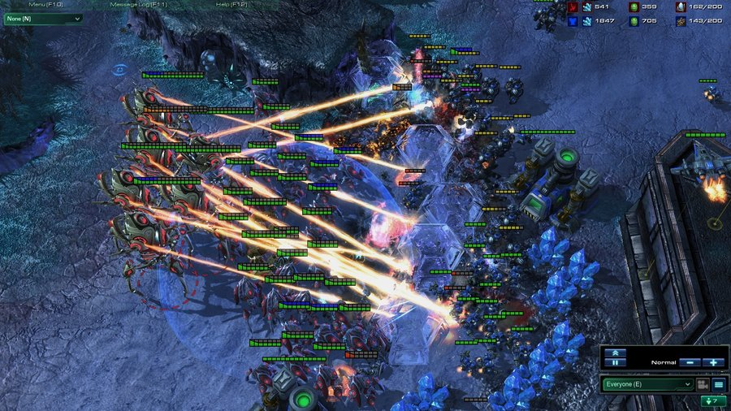
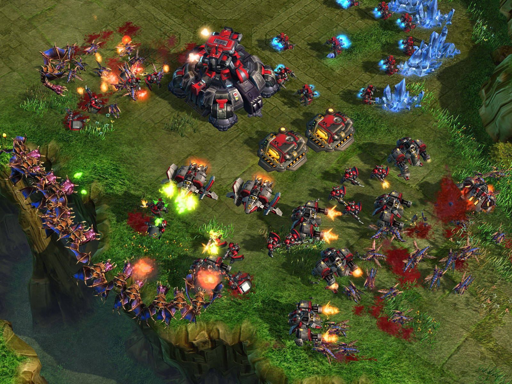
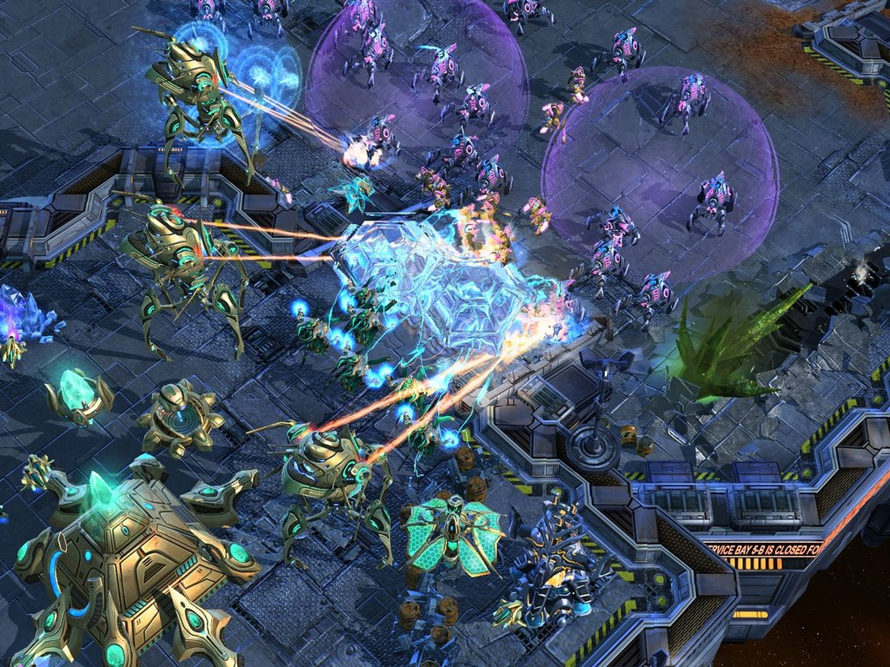
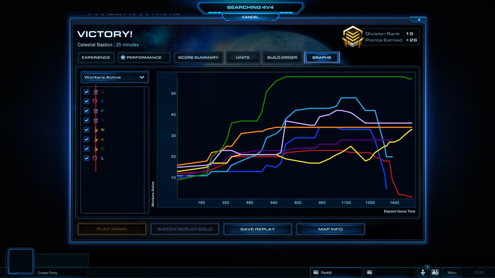

#1)


Write a DRAFT introduction. (It will likely change by the time you submit the final project.) From the final project assignment: 

"In this section, explain why you chose this topic, and the questions you are interested in studying. Include a brief description of how you found the data, and clear instructions on where the reader can find the data."


##Introduction


> This project is an exploratory data analysis of a dataset originating from the computer game "Starcraft II" (henceforth referred to as "SC2" for short). SC2 belongs to the real-time strategy (RTS) genre, which typically involve players managing military bases and directly controlling armies in order to combat opposing players' armies and destroy their bases. In SC2, players control one of three factions, each with completely different playstyles and abilities. All player actions happen in real-time. Thus, a successful player must be able to construct buildings, gather resources, and raise an army while simultaneously controlling existing combat units. This dichotomy is referred to macromanagement and micromanagement, or "macro" and "micro" for short. A more detailed description of the game written by the researchers who compiled this dataset can be found [here](http://skillcraft.ca/about-the-project.html).


> The dataset used for this analysis originates from the research paper [Video Game Telemetry as a Critical Tool in the Study of Complex Skill Learning](http://journals.plos.org/plosone/article?id=10.1371/journal.pone.0075129#pone-0075129-g001) (Thompson et al, 2013) and can be found [here](http://summit.sfu.ca/item/13328). From August 12th, 2011 to September 19th, 2011, the researchers solicited members of various online SC2 community hubs for their game replay files, from which I found out about this study. Contributors were also asked to complete a survey that asked about their age, skill level, and playing habits. Data points with a *LeagueIndex* value of 8 indicate replay files of professional games that were shared with the public. These replays were subsequently submitted to the study by community members, which is why these replays all have missing values for self-reported variables.


> The purpose of this study is to investigate SC2 as a tool for measuring how people learn and acquire expertise. These replay files are a complete record of everything that happens during the course of a game, including various metrics related to the game state, what each player is looking at, and where every game unit is located at any given point in time. These games were played on the 1 vs. 1 online ladder system, which places players in one of seven "leagues" according to a "ladder rank" calculated by a matchmaking algorithm. One's ladder rank is based on his or her win-loss record and the ladder rank of the opponent in each game. When a player wishes to play, the system attempts to find an opponent with a similar ladder rank. 





> What makes SC2 an interesting game to study is the fact that the sheer complexity of the game in terms of all the things that could happen at any given moment compounded across an entire game means that every game is unique. Each game can unfold in a seemingly infinite number of different ways. The popularity of SC2 has led to a sustained professional scene, where players are sponsored by teams and compete in tournaments for cash prizes. These tournaments can take place online or offline, where players are flown into a studio or arena to compete in front of a live audience. These events are accompanied by commentators who serve a similar role to those in traditional sports. In the past, the first place prizes at the most prestigious tournaments have reached $100,000. This competitive scene has provided the game's passionate fanbase with a clear motivation for becoming better at the game. The professional players serve as role models for how to become better (A beginner's guide to competitive SC2 can be found [here](https://www.youtube.com/watch?v=JSPRgL4D1no)). As a passionate member of this community during the time that this dataset was compiled, I made a serious (but short-lived) attempt to improve my SC2 skill level, during which I absorbed various advice and generally accepted wisdom on how one can get better at the game, as well as a deep appreciation for the talents of professional SC2 players. With this dataset, I would like to see if these community best practices are supported by the differentiation of skill levels based on the league placement of the study participants. At the conclusion of their paper, the researchers discussed the next study that they were embarking on, which involved accepting large numbers of replay files from each participant in order to search for changes in skill level over time. Though each data point in this dataset represents a single moment in time for one player, I want to explore how in-game metrics change across age groups and experience levels both within and across ranks. I plan on using variables in the dataset related to time to see if there are any general trends over time that can be discerned.


> The researchers approached this study from a cognitive science perspective, introducing a new unit of measurement called the Perception-Action Cycle (PAC), which attempts to quantify skill in terms of the amount of time elapsed between a player perceiving an event and acting upon it (a more detailed explanation of the PAC can be found [here](https://www.youtube.com/watch?v=bnRQMv0xIgg)). They hypothesized that the variables that are most correlated with skill change as a player improves and moves up the ranks of the ladder and showed that machine learning methods can be used to predict a player's rank based on such variables. I wish to avoid using variables related to PAC since I don't believe that I have the necessary cognitive science background to understand how they were derived and what they signify. Also, I want to avoid retreading the path the researchers took, since their paper focused heavily on PAC and its relation to skill level.


#2) 


Write a DRAFT description of the Team section.

"List team members and a description of how each [WILL] contribute to the project."


> Since I am working alone for this project, I am planning on exploring and analyzing this dataset with the following agenda:


***

1. Check the self-reported variables for nonsensical/missing/outlier values and decide on a way to deal with them
2. Analyze the three self-reported time variables not derived from the replay files, *TotalHours*, *HoursPerWeek*, and *Age*
3. Propose an approximate order of in-game metric importance (in terms of which skills the SC2 community deems essential for increasing skill level as opposed to what's "nice to have", similar to Maslow's hierarchy of needs)
4. Explore these variables individually in the order proposed
5. Visualize these variables together with the time variables to get an imprecise idea of how these metrics changes over time
6. Create multivariate plots to find possible relationships between different metrics across different leagues and experience levels

***

#3) 


Choose four variables that you consider to be important and begin analyzing them, following the advice in Chapter 8, sections 1 & 2, of Graphical Data Analysis with R, to begin by summarizing and plotting individual variables. Histograms and bar charts work well for this purpose, but you can use whatever techniques you find appropriate. (However, do not use graphs involving circles to communicate information. That includes pie charts, donut charts, polar coordinates, scatterplots using the size of the dots to represent quantities, and similar. We will discuss the reason for this rule in class.)


> My analysis begins with loading the csv file containing the dataset and converting integer variables that were imported as factors. I then create a new variable called *rank* that adds the proper name for each player's league based on the *LeagueIndex* variable.


```{r warning=FALSE, message=FALSE}

library(tidyverse)

sc <- read.csv('StarCraft2ReplayAnalysis-1.csv')

#Convert factors back to integers
#Automatically replace "NULL" string values with "NA"

sc$TotalHours <- as.integer(as.character(sc$TotalHours))
sc$HoursPerWeek <- as.integer(as.character(sc$HoursPerWeek))
sc$Age <- as.integer(as.character(sc$Age))

#Add a new variable 'rank' so that the values in the included "LeagueIndex" variable are associated with the names of each league

rank <- c('Bronze', 'Silver', 'Gold', 'Platinum', 'Diamond', 'Master', 'GrandMaster', 'Professional')
rank <- factor(rank, levels = c('Bronze', 'Silver', 'Gold', 'Platinum', 'Diamond', 'Master', 'GrandMaster', 'Professional'))
sc <- mutate(sc, League = rank[LeagueIndex])

```


> Since my analysis will partly be focused on the change in player metrics as a function of time, it would be appropriate to start with the two time variables, *HoursPerWeek* and *"*TotalHours*"*. Like other variables that are outside the scope of any single game, they contain self-reported values based on a survey that participants filled out when submitting their replay files. Thus, they are prone to reporting inaccuracy due to the fact that participants are attempting to generalize several months of playing experience and habits into two numbers. 


```{r}

summary(sc$HoursPerWeek)
summary(sc$TotalHours)

```


> What immediately stands out in the summary statistics is the maximum values for both variables. The maximum value for *HoursPerWeek* corresponds to 24 hours per day of playing time every week, while the maximum reported value of 1,000,000 for *TotalHours* far exceeds the number of hours that had elapsed since SC2 was released to the time that the data collection period concluded. When I discussed this matter with Professor Robbins, one of her suggestions was to "fence" the values such that outliers are replaced with a sensible ceiling value. From interviews of professional players as well as hearsay from those who keep in contact with them, I chose 98 hours played per week as a ceiling value. This corresponds to 14 hours played per day, which is a habit that could most likely only be sustained by professional players signed to a major team. Such teams often operate a "team house" where all the players live and train together. It is not uncommon for the sponsors to hire maids to cook and clean so that the players can focus all their attention on playing SC2. In such cases, it is not unusual for players to devote 10-14 hours per day to practicing for upcoming important matches. As for the single data point with a value of 0 hours per week, I interpreted that as the respondent playing the game very infrequently. Because there was only one such data point and the fact that the next closest value is 2, I decided not to remove it. 


```{r warning=FALSE, message=FALSE}

#Restrict "HoursPerWeek" to a maximum value of 98

sc$HoursPerWeek <- ifelse(sc$HoursPerWeek > 98, 98, sc$HoursPerWeek)

summary(sc$HoursPerWeek)

ggplot(sc, aes(sc$HoursPerWeek)) + geom_density(bw = 2.5, fill = 'purple', alpha = .5) + labs(x = 'Reported Hours Played Per Week') + scale_x_continuous(breaks = c(seq(0, 100, by = 5))) + theme(panel.background = element_rect(fill = 'white'), panel.grid.major =  element_line(color = 'gray'))

```

> This variable looks to be unimodal after adjusting the bandwidth of the density plot, with a mode of approximately 7 and a mean of 15.87. The mean value corresponds to around 2 hours per day of play, which sounds reasonable for that time period, during which the game was still relatively new and the fanbase was at its largest. The distribution is right-skewed, which gives an idea of how many 'typical' players there are compared to the more dedicated ones 


> Similarly, I restricted the maximum value for *TotalHours* to 8,106. I arrived at this theoretical maximum by counting the number of days from the earliest date that a member of the general public could begin playing the game consistently (the pre-release beta test period began on February 17th, 2010) to the end of the data collection period, September 19th, 2011. Assuming that an extremely dedicated fan played the theoretical maximum of 14 hours per day every day during that period, he or she will have played the game for a total of 8,106 hours. 


```{r warning=FALSE, message=FALSE}

#Restrict "TotalHours" to a maximum value of 8106

sc$TotalHours <- ifelse(sc$TotalHours > 8106, 8106, sc$TotalHours)
summary(sc$TotalHours)
ggplot(sc, aes(sc$TotalHours)) + geom_histogram(binwidth = 200, fill = 'purple', alpha = .5) + labs(x = 'Reported Total Number of Hours Played') + theme(panel.background = element_rect(fill = 'white'), panel.grid.major =  element_line(color = 'gray'))

```


> In the above histogram, several outlier values that are well below 8,106 hours and yet well above the median of 500 can be seen. Sustaining a 14 hour per day SC2 habit in addition to sleep time and any possible school and work responsibilities would be quite difficult. Even a professional player would have trouble keeping up with that level of practice for an extended period of time without feeling mental exhaustion or experiencing wrist injuries. Therefore, I decided to further restrict this variable to a maximum value of 4,000 hours, which corresponds to approximately 7 hours per day. 


```{r warning=FALSE, message=FALSE}

#Further restrict "TotalHours" to a maximum value of 4000

sc$TotalHours <- ifelse(sc$TotalHours > 4000, 4000, sc$TotalHours)
summary(sc$TotalHours)

ggplot() + geom_histogram(data = sc, aes(x = sc$TotalHours), binwidth = 200, fill = 'purple', alpha = .5) + labs(x = 'Reported Total Number of Hours Played') + scale_x_continuous(breaks = c(seq(0, 4000, 250))) + theme(panel.background = element_rect(fill = 'white'), panel.grid.major =  element_line(color = 'gray'))

ggplot() + geom_density(data = sc, aes(x = sc$TotalHours), bw = 75, fill = 'purple', alpha = .5) + labs(x = 'Reported Total Number of Hours Played') + scale_x_continuous(breaks = c(seq(0, 4000, 250)))  + theme(panel.background = element_rect(fill = 'white'), panel.grid.major =  element_line(color = 'gray'))

```


> The distribution for *TotalHours* looks to have a larger variance compared to that of *HoursPerWeek*. Both distributions are similarly right-skewed, which is to be expected since these two variables are most certainly correlated. Depending on the parameter settings for the density plot and histogram, there might be evidence of bimodality, with a distinct mode of approximately 450 and another possible one of at approximately 700. The mean of 639.2 corresponds to approximately 1.5 hours of SC2 per day, which translates to around four average length 1 vs. 1 matches. 


> Although age is only an indirect indicator of the passage of time, I want to search for trends across different age groups. In the Starcraft community, it is commonly believed that one's skill declines with age, such that past the early to mid 20's, hand movement and reaction speeds begin to slow down. This belief is reinforced by the fact that an overwhelming majority of tournament champions are relatively young, often still in their teens. While the researchers plan to investigate whether or not such a physiological decline actually occurs in their next study, I feel that it would be sensible to see if there's any supporting evidence for this belief using this dataset, even though it's not as scientifically valid as analyzing a large quantity of replay files associated with individual players' experiences with the game over a long period of time.


```{r warning=FALSE, message=FALSE}

summary(sc$Age)

ggplot(sc, aes(sc$Age)) + geom_histogram(binwidth = 1, fill = 'purple', alpha = .5) + scale_x_continuous(breaks = c(seq(10,44, 2))) + labs(x = 'Age of the Participant') + theme(panel.background = element_rect(fill = 'white'), panel.grid.major =  element_line(color = 'gray'))


ggplot(sc, aes(sc$Age)) + geom_density(bw = .5, fill = 'purple', alpha = .5) + labs(x = 'Age of the Participant') + theme(panel.background = element_rect(fill = 'white'), panel.grid.major =  element_line(color = 'gray')) + scale_x_continuous(breaks = c(seq(10,44, 2)))

```


> A noticeable feature of this distribution is the abrupt cutoff point at 16. This is most likely due to ethical restrictions that the researchers adhered to with respect to allowing minors to participate in the study, rather than a lack of younger SC2 players. Were it not for this, the age distribution would look almost normally distributed, with a mode of 21 and mean of 21.65. The distribution proceeds fairly smoothly to the maximum age of 44. Due to the smoothness of the distribution, I decided to not treat participants in their early 40's as outliers. The slope of the distribution significantly decreases past age 22, which lends support to the community's perceived notions concerning age and skill level.








> Proceeding to the in-game metrics, I feel that the most obvious one to explore is *APM*, short for Actions Per Minute. An action is defined to be any key press or mouse click performed by the player. In SC2, *APM* is almost synonymous with level skill. It is typically understood that if a player can't perform actions at a rate that is comparable to that of the opponent, then he or she simply can't keep up and will eventually be overwhelmed due to the fact that the opponent can accomplish more in the same amount of time. The description accompanying this dataset does not specify whether the included *APM* values are average or maximum values achieved during each game. I assume that they represent average values since average APM is one of the metrics that the game presents to the player at the conclusion of each game.





> During battles, a skilled player should be able to position his army properly and micromanage several units simultaneously without neglecting the more mundane tasks of producing workers and constructing buildings back at base. Winning a battle while forgetting to manage one's bases could leave one in a worse position and allow the opponent to catch up in the near future.


```{r}
summary(sc$APM)

ggplot(sc, aes(sc$APM)) + geom_density(bw = 3, fill = 'purple', alpha = .5) + labs(x = 'Actions Per Minute') + theme(panel.background = element_rect(fill = 'white'), panel.grid.major =  element_line(color = 'gray')) + scale_x_continuous(breaks = c(seq(20,400, 20)))

```


> The distribution for *APM* looks to be approximately normally distributed, with a median of 108 and a mean of 117. The slope  on the left side is much steeper, with a minimum value of 20. This sounds reasonable, since 20 actions per minute can be achieved by nearly any able-bodied person using a computer without much effort. On the other end, we see some values exceeding 360, which translates to a sustained rate of 6 actions per second. Though there have been a few professional players who were known for consistently attaining such exceptionally high APM values, it could also be the case that the *APM* outlier values in this dataset are due to some players inflating their APM by rapidly performing meaningless actions, such as clicking empty spaces. Often, players do this at the beginning of a game to warm up their hand muscles since there's typically not much to do at such an early stage of a game. However, it could be the case that some players continue doing this throughout their games, possibly with the intention of inflating their APM rate. A few years after these replays were collected, an improved APM measurement that filters out such meaningless actions was added to the game. Using that metric, we would be unlikely to see such extreme values.


```{r}

ggplot(sc, aes(sc$League, sc$APM)) + geom_boxplot(outlier.color = 'blue', fill = 'purple', alpha = 0.5) + theme(panel.background = element_rect(fill = 'white'), panel.grid.major =  element_line(color = 'gray')) + labs(x = 'League Rank', y = 'APM') + scale_y_continuous(breaks = c(seq(0, 400, 25)))

```


> Plotting the distribution of APM versus league rank supports the idea these outlier *APM* values were artificially inflated. They originate from players in Diamond and Master League, which is far from the highest levels of competitive play. These outliers are far removed from the median values of their respective leagues. The fact that several values exceed even the median APM for professional players suggests that they are not realistically attainable values for players in these leagues. Therefore, I decided to restrict *APM* values originating from players of these two leagues to a maximum value of 275, which is the approximate median value for the professional players represented in this dataset.


```{r}

#Restrict APM values originating from Diamond and Master League to a maximum value of 275

sc$APM <- ifelse(sc$APM > 275 & sc$League == 'Master' | sc$APM > 275 & sc$League == 'Diamond', 275, sc$APM)

ggplot(sc, aes(sc$League, sc$APM)) + geom_boxplot(outlier.color = 'blue', fill = 'purple', alpha = 0.5) + theme(panel.background = element_rect(fill = 'white'), panel.grid.major =  element_line(color = 'gray')) + labs(x = 'League Rank', y = 'APM') + scale_y_continuous(breaks = c(seq(0, 400, 25)))

ggplot(sc, aes(sc$APM)) + geom_density(bw = 3, fill = 'purple', alpha = .5) + labs(x = 'Actions Per Minute') + theme(panel.background = element_rect(fill = 'white'), panel.grid.major =  element_line(color = 'gray')) + scale_x_continuous(breaks = c(seq(20,400, 20)))

```


> Having removed these outlier values, the shape of the density plot did not change much, but the boxplot looks more reasonable. There is a positive correlation between *League* and *APM* that supports the idea that APM is a reasonable indicator of skill level. However, it should be noted that player actions can rarely be accurately categorized as either "meaningful" or "meaningless". There are often several events happening simultaneously across the battlefield that demand a player's attention. SC2 expertise heavily depends on the ability to prioritize these events and focus attention on the most important ones. To give two extreme examples, a player who devote full attention to only controlling a single unit at a time will most likely not win too many games, much like a player who instantly shifts his or her attention to the latest event without any prioritization. Even with "meaningful" actions, the decisions that a player makes can be judged on a continuous scale of effectiveness that depends on the context of what is happening and what the player knows at that moment. In broadcasted games, commentators are expected to analyze these decisions and point out which ones they think are wise or unwise. Thus, one cannot declare that one player is definitely better than another player based solely on a comparison of APM.


